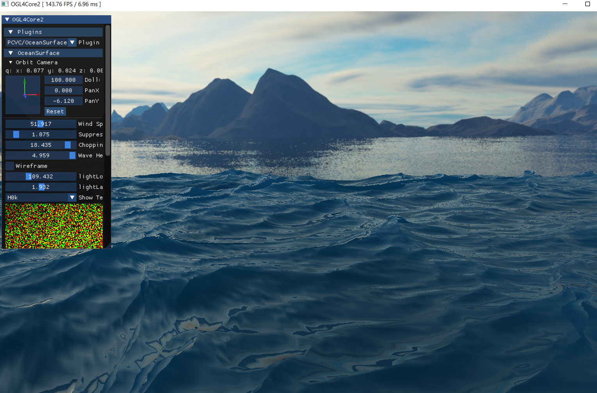

# Ocean Surface Simulation 
 FFT based Ocean Surface Simulation based on [J.Tessendorf's paper](https://people.computing.clemson.edu/~jtessen/reports/papers_files/coursenotes2004.pdf)

 Computation of the ocean surface is mainly done on the GPU, using the compute shaders.
 GPU exceeds CPU computation in terms of speed and performance, processing multiple data at once and providing vector as basic units.
 RGBA texture formats are used as data storage in the GPUs and scalar values can be stored as a vector, using each texture channels.
 
 Controllable variables (Wave Height, Choppiness, Wind Speed, Suppression Factor) that design the waves can be adjusted in the GUI pannel, 
 and the textures(as data storage) used for the intermediate computations are also displayed.
 
## Screenshot
 
 
 ## Dependencies
 Using OGL4Core developed at the Visualization Research Center of the University of Stuttgart (VISUS). 
 
 ## References
* J. Tessendorf, Simulating Ocean Water, 1991.
* H.Li, H. Yang, and J.Zhao 1, 2Water Reflection, Refraction Simulation Based on Perlin Noise and Ray-tracing, International Journal of Signal Processing, Image Processing and Pattern Recognition
* Simulating Ocean Waves, Scratchapixel
* D.Lee and S.Lee, Synthesis of Ocean Wave Models and Simulation Using GPU, KIPS Transactions on Software and Data Engineering, 2007.
